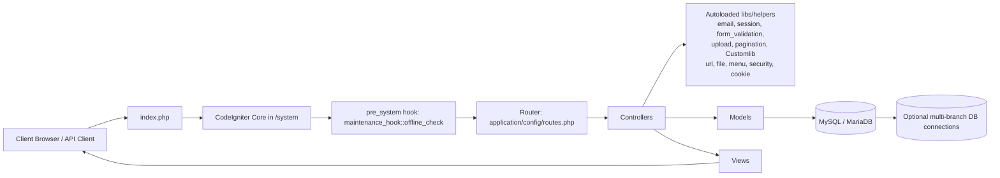
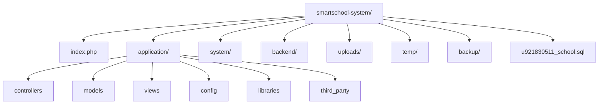

# SmartSchool System: Project Graph

## 1) Runtime Flow



## 2) Application Domain Graph

```mermaid
flowchart TB
    APP[application/] --> CFG[config]
    APP --> CORE[core\n(MY_Controller, MY_Model)]
    APP --> HK[hooks]
    APP --> LIB[libraries\n(custom integrations)]
    APP --> CTR[controllers]
    APP --> MOD[models]
    APP --> VWS[views]
    APP --> TP[third_party]

    CTR --> ADM[admin/ controllers\n116]
    CTR --> USR[user/ controllers\n54]
    CTR --> OLA[onlineadmission/ controllers\n28]
    CTR --> GWI[gateway_ins/ controllers\n6]
    CTR --> ROOTC[(root controllers)\n29]

    MOD --> MODALL[154 model files]

    VWS --> VADM[admin views\n405]
    VWS --> VUSR[user views\n101]
    VWS --> VTH[themes views\n93]
    VWS --> VRPT[reports views\n56]
    VWS --> VOLA[onlineadmission views\n34]
    VWS --> VOTH[other view groups]

    TP --> OMP[omnipay]
    TP --> PHPM[PHPMailer]
    TP --> JWT[jwt]
    TP --> FBASE[firebase]
    TP --> PGW[payment SDKs\nbillplz, midtrans, pesapal]
```

## 3) Top-Level Filesystem Topology



## 4) Quick Notes

- This is a large CodeIgniter monolith with classic MVC layering.
- Most business surface area is in `application/controllers/admin`, `application/views/admin`, and model files in `application/models`.
- Cross-cutting behavior includes:
  - Maintenance mode hook (`application/hooks/maintenance_hook.php`).
  - Custom framework extensions (`application/core/MY_Controller.php`, `MY_Model.php`).
  - Many payment and messaging integrations in `application/libraries` and `application/third_party`.
