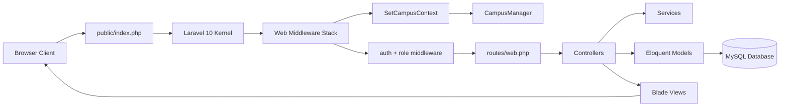
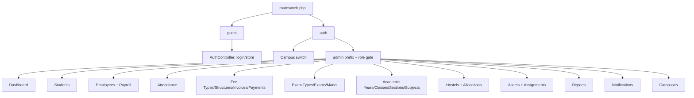
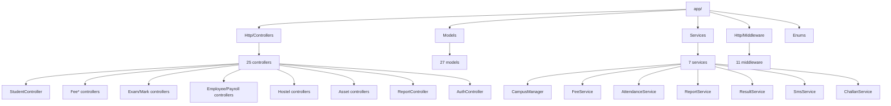
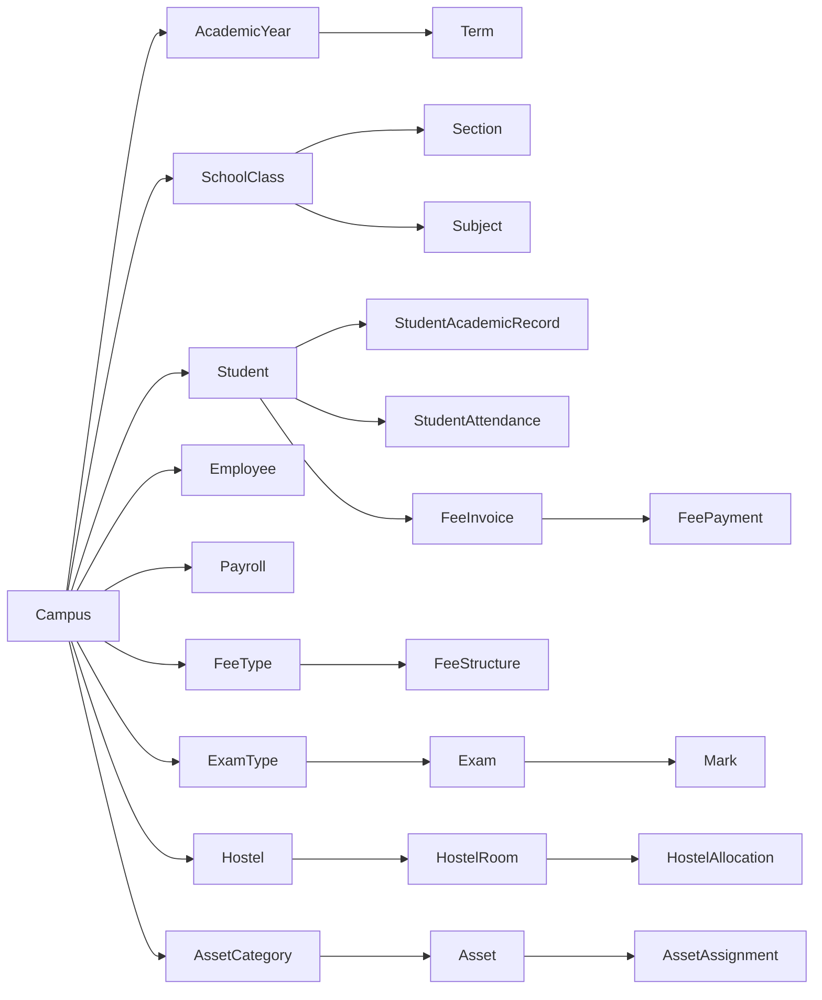
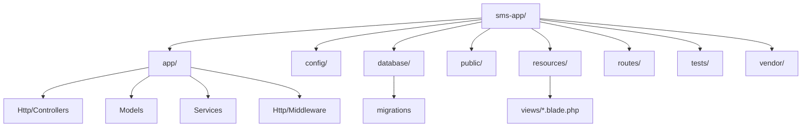

# EDUS Multi iSchool (sms-app): Project Graph

## 1) Runtime Request Flow

## 2) Route & Access Graph

## 3) Application Module Graph

## 4) Data Domain Graph (From Migrations/Models)

## 5) Filesystem Topology

## 6) Quick Notes

- Tech stack: `Laravel 10` + PHP `^8.1`.
- Multi-campus scoping is a core architectural concept via `SetCampusContext` + `CampusManager`.
- Most functional routes are under `admin` prefix with role-based access:
  - `campus_admin`, `principal`, `teacher`, `accountant`.
- Core product modules implemented: academics, students, staff/payroll, attendance, fees, exams/marks, hostel, assets, notifications, reports.
